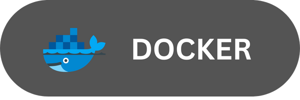

<h2 align="center">Hi there 👋</h2>

Welcome to my GitHub! I'm Hakan KARAYILMAZ.I have been developing myself as a frontend developer for
a while.I love teamwork, spending time on computer,mostly learning and applying new staff.

   

  

<!-- 

<h2 align="center"> 🚀 TECH STACK 🚀 </h2>

<h2 align="center">🔥 TOOLS and WEBSITES I use during the day 🔥</h2>
 

 -->

<h2 align="center">⚡ Connect With Me ⚡</h2>
 
              

 

             
              
 
  
  <h2 align="center">⚡ Github Stats ⚡</h2>
 

  

   

  

    

  
